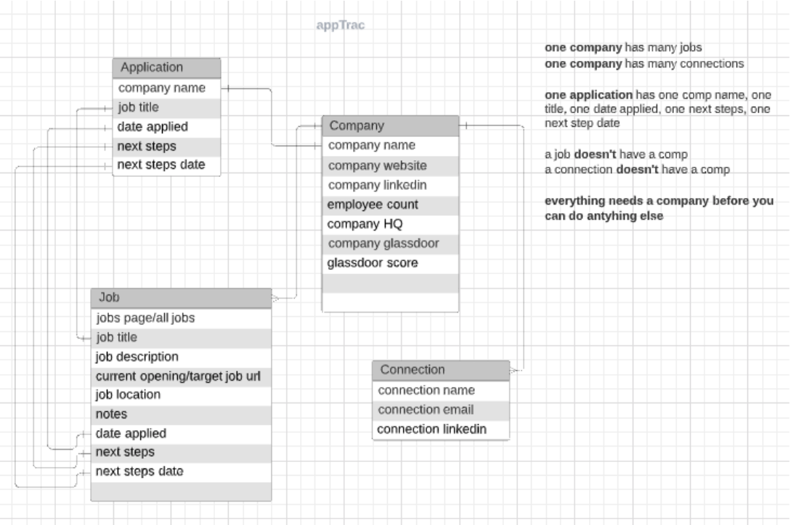

# appTrac
Application tracking software to help applicants stay organized as they search for new employment opportunities. With appTrac, you can easily which applications require your immediate attention and which interviews you have coming up next.

##### __Technologies Used__  
appTrac was built using a MERN stack and all depencie are listed in the packagejson file.

### __USER STORY__

##### __The Home Page__  
When a user goes to https://melisalarson.github.io/appTrac-client/ s/he will land on the home page. On the home page, the user will see:
 
-the navbar
	The navbar includes:
-The name of the application on the top left (appTrac)
-Login and Register links on the top right
These links will redirect the user to the login or register page where a card with the appropriate info will be displayed. For register (email/username/password) and for login (username/password).
-A link to see all companies that the applicant is tracking. This is located to the left of Login and Register 
-the upcoming events section
	This section includes:
-A list of all current/active applications that require attention in the form of cards
-A user can click on each card to be redirected to the application details page...
-the applications section
	This section includes:
-A list of all applications in the form of cards, regardless of status, yet organized by status where initial status are listed first and final status listed last
-A user can click on each card to be redirected to the application details page...
-and a “+ create new” button on this page
	This button:
		-Redirects the user to the application details page...
 
 
##### __The Application Details Page__  
The user accesses this page by either clicking on the “+ create new” button on the home page or clicking on the card for an individual application. On this page the user will see more details about the company, the jobs, and the connections:
-the company section
	This section includes:
-The company name, company website, company HQ location, company Linkedin, employee count, company glassdoor, and glassdoor score
-Edit, Delete buttons
-the jobs section
	This section includes:
-The company’s jobs page, current opening page, job location, date applied, next steps, next step date, job title, job description, and notes
-Add, Edit, Delete buttons
.....If no jobs are listed the following message will display:	
Looks like you haven’t found any jobs at [link to company careers page], when was the last time you looked at their careers page?
-and the connections section
	This section includes:
		-The connection’s name, email and linkedin
		-Add, Edit, Delete buttons
.....If no connections are listed the following message will display:
Looks like you don’t have any connections at [link to company linkedin]. Go make one!
-Add button: will add a new job or a new connection. This will display the current page (application details page) with editable fields. Job and connection fields will be blank and company fields will be pre-populated.
-Edit button: will edit the current company, job, or connection. This will display the current page (application details page) with editable fields. All fields will be pre-populated.
-Delete button: will delete the current company, job, or connection. If a company is deleted, the jobs and connections within that company will be deleted as well. If a job or a connection is deleted the company will not be deleted.
 
 
##### __The Status Details Page__  
The user accesses this page by clicking on the “application status” label or the “upcoming events” label on the home page. On this page the user will see a list of applications in the form of cards for that particular status clicked.
 
This page holds similar functionality as the home page, it includes:
-a subtitle/label equivalent to the application status clicked
-a list of all applications in the form of cards, organized alphabetically
-A user can click on each card to be redirected to the application details page…
-and a “+ create new” button which
-Redirects the user to an editable version of the application details page with blank fields...
 
This page came up as a necessity for when wanting to review applications in the “no current openings” category, so that the user can quickly glance through companies that were once of interest but didn’t have any openings at the time of the job search. A great use case for this page is for the user to visit frequently and check on the company’s career page to see if there are any new openings.
 
 
##### __The All Companies Page__  
The user accesses this page by clicking on the “all companies” link on the home page. On this page the user will see a list of all the companies that are currently in the database. The purpose of this page is for the user to quickly revisit all of the companies s/he has created to access a specific company the second time around for viewing more details and editing purposes, etc. The name of the company will be a link to the application details page.

### __ERD__

### __WIRE FRAME__

### __SCHEDULE__
<!-- schedule table start -->
<table>

<thead>
<tr>
<th>DAY</th>
<th>TASKS</th>
</tr>
</thead>

<tbody>
<tr>
<td>Thursday (8/20)</td>
<td>Project planning  
Userstory, ERD, Wireframe, and Schedule,   
Stack = MERN  
Project approval  
Start Coding  
Create react app and set up basic folder/file structure for back  
Create a seed.js file and applicationData.json file for adding sample data  
Set up routes  
Controllers  
Models  
</td>
</tr>
  
<tr>
<td>Friday (8/21)</td>
<td>Controllers cntd.  
Models cntd.  
Test in postman…  
</td>
</tr>

<tr>
<td>Saturday (8/22)</td>
<td>
Connect the Schemas  
</tr>

<tr>
<td>Sunday (8/23)</td>
<td>
Front - basic folder/file structure + App.js/App.css and index.js/index.css  
Front - Create containers/components in pages folder  
Front - Config routes.js  
Front - Create containers  
Front - Create containers  
</td>
</tr>

<tr>
<td>Monday (8/24)</td>
<td>
MVP Done  
Application status row  
Add second job and second connection  
Deploy  
</td>
</tr>

<tr>
<td>Tuesday (8/25)</td>
<td>
MVP Done  
Deploy  
</td>
</tr>

<tr>
<td>Wednesday (8/26)</td>
<td>
  Auth 
  Push 
</td>
</tr>

<tr>
<td>Thursday (8/27)</td>
<td>
Bring in Jimmy’s Notes section from his App  
Push  
CSS  
Push  

</td>
</tr>

<tr>
<td>Friday (8/28)</td>
<td>
Presentation 9:30am  
Bring in jimmy’s notes app  
</td>
</tr>

</tbody>

</table>
<!-- schedule table end -->

### __NEXT VERSIONS__
- __V2__
  - login and register functionality
  - upcoming events section up top
  - multiple jobs and multiple connections under one application

- __V3__
  - Bring in Jimmy’s Notes section from his App
